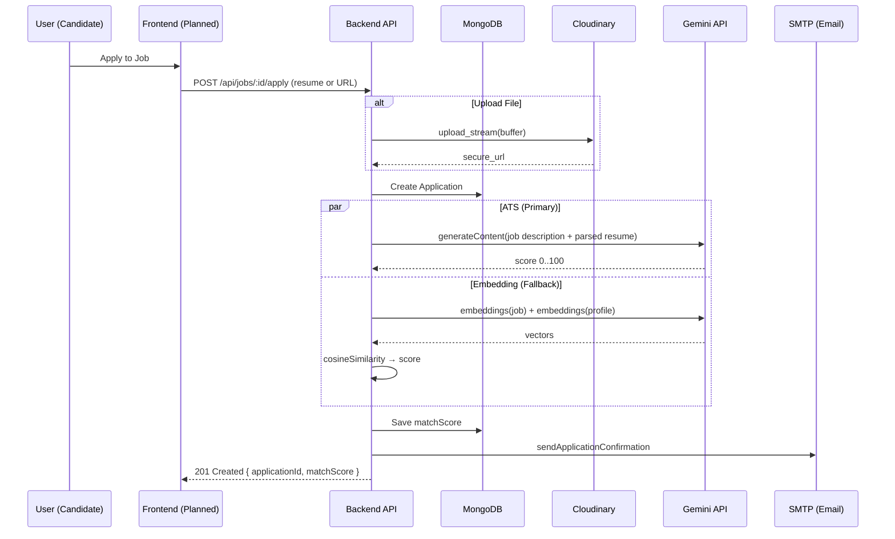
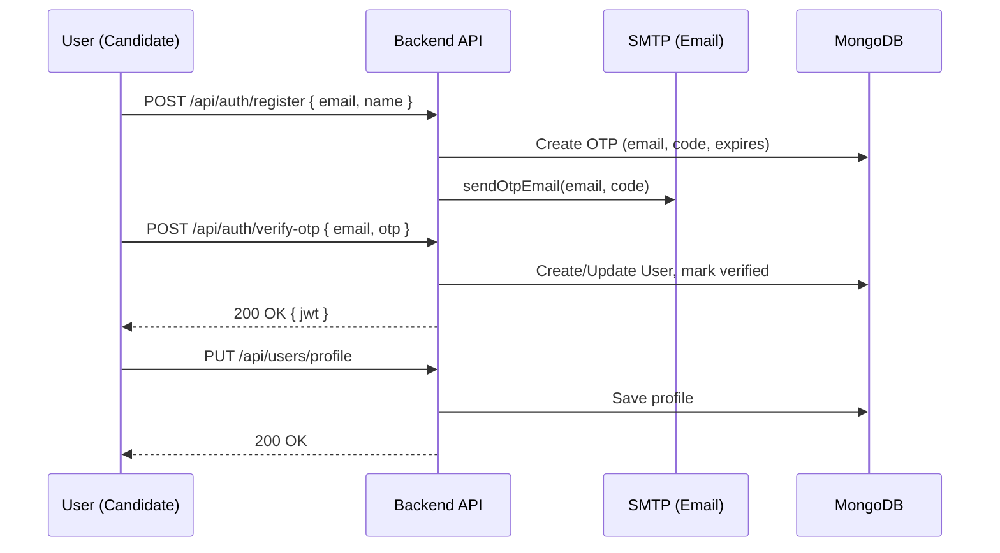
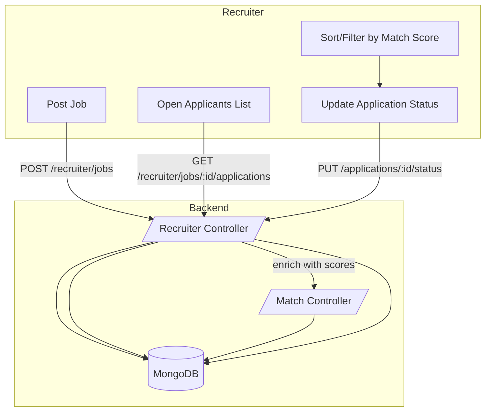
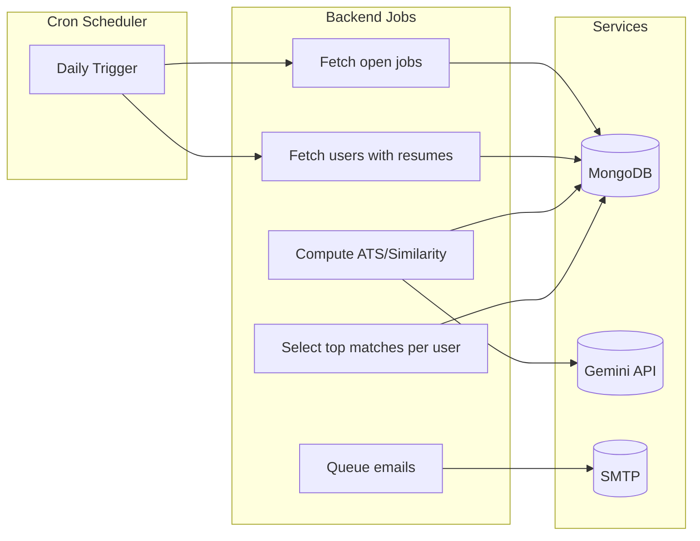
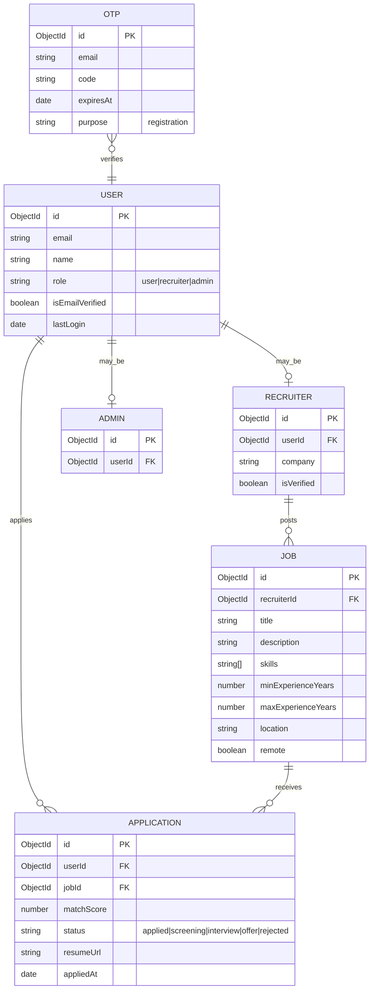

## Job Portal Project Report (Backend, Planned Frontend, Deployment, AI)

This document presents a comprehensive, lecturer‑friendly report of the Job Portal project, covering backend architecture and features, the planned React + Tailwind frontend, Vercel deployment plan, third‑party services and packages, and AI usage for ATS-style matching and recommendations.

### Executive Summary

- **Goal**: A modern job portal connecting candidates and recruiters with AI‑assisted matching and automated communications.
- **Status**: Backend implemented (Node.js, Express, MongoDB, JWT, emails, file uploads, cron jobs, AI services). Frontend planned (React + Tailwind).
- **Highlights**: Role‑based access, secure auth, Cloudinary uploads, AMP‑styled emails, daily AI recommendations, ATS scoring with Google Gemini, Dockerized services, and structured API.

## 1) Backend

### 1.1 Tech Stack

- **Runtime**: Node.js (Express.js)
- **Database**: MongoDB with Mongoose ODM
- **Auth**: JWT (stateless); role‑based authorization middleware
- **Security**: Helmet, CORS, bcryptjs
- **File Uploads**: Multer (memory) + Cloudinary
- **Email**: Nodemailer (Gmail or Brevo SMTP)
- **Background Jobs**: node-cron + lightweight in‑process queue
- **AI**: Google Gemini Embeddings + Generative API for ATS scoring
- **Containerization**: Docker and Docker Compose

### 1.2 Architecture Overview

- `src/server.js` initializes Express, middleware, routes, DB connection, health checks, and cron jobs.
- `src/routes/index.js` mounts feature routes: `auth`, `users`, `recruiter`, `admin`, `jobs`, `uploads`, `ai`, `email`.
- `src/middleware/` provides `auth` (JWT verify, role guard), `errorHandler`, and `uploadMulter` helpers.
- `src/models/` holds Mongoose schemas (User, Recruiter, Job, Application, Admin, Otp).
- `src/controllers/` implements core flows: applications, authentication (OTP + JWT), recruiter job lifecycle, AI matching endpoints.
- `src/services/` integrates **Cloudinary**, **Email**, **AI (Gemini)**, and **resume parsing**.
- `src/jobs/` houses cron jobs (ATS recommendations) and matching worker.
- `src/utils/` includes logging and a minimal async queue.

#### Request Lifecycle (simplified)

1) Client makes API call → 2) Security (Helmet, CORS) → 3) Auth middleware (JWT/role) → 4) Controller does DB and service ops → 5) Optional file upload to Cloudinary → 6) Emails queued → 7) Response → 8) Errors centralized via `errorHandler`.

### 1.3 Key Features (Backend)

- **Multi‑role**: user, recruiter, admin with RBAC middleware.
- **OTP Registration**: Email OTP for sign‑up verification and secure login.
- **JWT Auth**: Stateless tokens, profile fetch, logout semantics.
- **Jobs Module**: CRUD for recruiter jobs, public job listing/search, apply & save.
- **Applications**: Apply with resume file or URL, compute AI match score, notify user and recruiter.
- **AI Matching**:
  - Embedding‑based similarity with cosine similarity and skill intersections.
  - ATS‑style scoring via Google Gemini on parsed resume JSON.
  - Recruiter endpoints to view applicants sorted by match.
- **Automated Emails**: OTP, application confirmations, recommendations, profile reminders (HTML + AMP fallback).
- **Uploads**: Avatars, resumes, galleries via Cloudinary.
- **Cron Jobs**: Daily ATS recommendations to users based on resumes and open jobs.
- **Observability**: Health check endpoint and structured logging.

### 1.4 Notable Modules (with responsibilities)

- `src/controllers/authController.js`
  - Register (send OTP), verify OTP (create/update user), login, resend OTP, fetch profile, logout.
- `src/controllers/applicationController.js`
  - Apply to jobs with resume upload/URL, compute ATS score (Gemini) with embedding fallback, send confirmations.
- `src/controllers/recruiterController.js`
  - Create jobs, queue background matching, list applicants with scores.
- `src/controllers/matchController.js`
  - Compute top N matches for a job across users; enrich applicants with scores and skill insights.
- `src/services/aiService.js`
  - Gemini embeddings, cosine similarity, canonical text builders, ATS scoring via `generateContent`, resume parsing integration.
- `src/services/emailService.js`
  - Transporter (Gmail or Brevo), OTP and transactional emails (application, recommendations, reminders), AMP alternatives.
- `src/services/cloudinaryService.js` and `src/middleware/uploadMulter.js`
  - Cloudinary upload streams; Multer memory storage; file filters and size limits.
- `src/jobs/atsRecommendationCron.js`
  - Daily scoring of open jobs vs. users with resume URLs; thresholded recommendation emails.

### 1.5 API Highlights

- `POST /api/auth/register`, `POST /api/auth/verify-otp`, `POST /api/auth/login`
- `GET /api/users/profile`, `PUT /api/users/profile`
- `GET/POST/PUT/DELETE /api/recruiter/jobs`, `GET /api/recruiter/jobs/:jobId/applications`
- `GET /api/jobs`, `GET /api/jobs/:jobId`, `POST /api/jobs/:jobId/apply`
- `POST /api/ai/match-job/:jobId`, `GET /api/recruiter/job/:jobId/applicants`

### 1.6 Security Considerations

- Helmet headers, strict CORS allowlist via `CORS_ORIGIN`.
- JWT signature via `JWT_SECRET` and expiry `JWT_EXPIRE`.
- Password hashing with bcrypt; minimal PIIs in logs; centralized error handling without leakage in production.
- File type and size validation on uploads; Cloudinary offloads storage.

### 1.7 Authentication and OTP (In‑Depth)

#### Objectives

- Ensure only legitimate users can register and access protected resources.
- Minimize fraud/abuse during sign‑up via email ownership verification.
- Provide a smooth UX with OTP‑based verification and JWT sessions.

#### Data Model Involved

- `User` (core identity, hashed password, role, verification flags, profile completion, lastLogin)
- `Otp` (email, otp code, expiresAt, purpose)

#### Endpoints and Responsibilities

- `POST /api/auth/register`
  - Inputs: `email`, `name`
  - Validates email format and uniqueness (verified users).
  - Generates a 6‑digit OTP, stores it with 10‑minute expiry.
  - Sends OTP via email (HTML + AMP alt); logs OTP in non‑prod for debugging.
  - Output: success with email (and debugOtp in dev).

- `POST /api/auth/verify-otp`
  - Inputs: `email`, `otp`, optional `password`, optional `name`.
  - Verifies OTP for purpose `registration`; tolerant fallback in `NODE_ENV=test` for CI.
  - Creates or updates user, sets `isEmailVerified=true`, hashes password via model middleware.
  - Issues JWT with payload `{ id, role }` and expiry `JWT_EXPIRE`.
  - Updates `lastLogin`.

- `POST /api/auth/login`
  - Inputs: `email`, `password`.
  - Fetches user (including password), checks active + verified.
  - Compares password with bcrypt; returns JWT and sanitized user profile.

- `POST /api/auth/resend-otp`
  - Inputs: `email`.
  - Deletes existing OTPs for the email/purpose, generates a fresh code, emails it.

- `GET /api/auth/me`
  - Authenticated via `Authorization: Bearer <token>`.
  - Returns current user profile data.

- `POST /api/auth/logout`
  - Stateless JWT design; client removes token. Placeholder for future blacklist if needed.

#### Middleware

- `verifyToken` extracts and verifies JWT, attaches sanitized `req.user`.
- `authorize(...roles)` ensures the requester has one of the allowed roles.
- `optionalAuth` allows enhanced responses for logged‑in users while still serving anonymous users.

#### OTP Generation & Validation

- OTPs are generated server‑side (6 digits), stored with purpose `registration` and `expiresAt = now + 10min`.
- Comparison is done server‑side; on success, the OTP is consumed/invalidated (implementation in model method).
- In test environments, a timing‑safe fallback check allows consistent CI.

#### Security Controls

- Email format validation and case normalization.
- Limited OTP validity window (10 min) and single‑use semantics.
- Logging OTP only in non‑production; no OTP exposure in prod responses.
- JWT signed by `JWT_SECRET`; expiry from `JWT_EXPIRE` (default 7d).
- Deactivated accounts are blocked even with valid JWT.
- Central error handler prevents leakage of sensitive internals.

#### Edge Cases & Handling

- Duplicate verified user on register → 400 with friendly message.
- Invalid/expired OTP → 400.
- Multiple OTPs → old ones are purged on resend.
- Password optional during OTP verify; can be set later (default placeholder set during creation if absent).
- Rate‑limiting (future): throttle register, resend‑otp, and login endpoints.

#### Future Enhancements

- Add device‑bound refresh tokens and token rotation.
- Add rate limiting and CAPTCHA to deter abuse.
- Add passwordless login (magic link) and social sign‑in as optional.
- Add TOTP (Google Authenticator) for admin/recruiter 2FA.

### 1.8 Environment Variables (selected)

- `MONGODB_URI`, `JWT_SECRET`, `JWT_EXPIRE`
- `EMAIL_USER`/`EMAIL_PASS` or `BREVO_SMTP_USER`/`BREVO_SMTP_PASS`
- `CLOUDINARY_CLOUD_NAME`, `CLOUDINARY_API_KEY`, `CLOUDINARY_API_SECRET`
- `GEMINI_API_KEY` or `GOOGLE_API_KEY`, optional `GEMINI_MODEL`
- `CORS_ORIGIN`, `PORT`, `NODE_ENV`

## 2) Planned Frontend (React + Tailwind)

### 2.1 Stack and Principles

- **Framework**: React (Vite or Next.js if SSR/SEO needed later)
- **Styling**: Tailwind CSS with component abstractions (e.g., Headless UI/Radix optional)
- **State**: React Query for server state; Context/Zustand for UI/local state
- **Routing**: React Router (for Vite) or Next.js App Router
- **Forms**: React Hook Form + Zod for schema validation
- **API Layer**: Fetch/axios with JWT auth header and error interceptors

### 2.2 Planned UX Flows

- Auth: register with OTP, verify, login; profile setup and completion progress.
- Candidate: browse/search jobs, view details, apply with resume URL/upload, save jobs, application history.
- Recruiter: post jobs, view applicants ranked by AI match score, manage statuses.
- Admin: dashboards for users/recruiters/jobs, verification, moderation, analytics.

### 2.3 Component Sketches

- `JobCard`, `JobFilters`, `JobDetails` with sticky apply pane
- `ApplicationList` with match score badges and skill chips
- `ProfileWizard` with completion meter; resume upload with progress
- `RecruiterDashboard` with sortable tables (score, date, status)

## 3) Deployment (Vercel for Frontend)

Frontend will be deployed on Vercel. Backend can run on a container‑friendly host (Render/Railway/Dokku/EC2) or remain local during early demos.

### 3.0 Deployment Architecture Diagram

```mermaid
flowchart LR
  subgraph GitHub
    GH[Repository: frontend + server]
  end

  subgraph Vercel
    VPrj[Vercel Project (frontend/)]
    VBuild[Build & Preview]
    VProd[Production Deployment]
  end

  subgraph Backend Host
    BE[Node/Express API (server/)]
    DB[(MongoDB)]
  end

  subgraph Third-Party
    CL[(Cloudinary)]
    EM[(SMTP: Gmail/Brevo)]
    AI[(Gemini API)]
  end

  User[(Browser)] -->|HTTPS| VProd
  VProd -->|API calls| BE
  BE --> DB
  BE --> CL
  BE --> EM
  BE --> AI
  GH -->|Import| VPrj
  VPrj --> VBuild --> VProd
```

### 3.1 Vercel Frontend Deployment Steps (React + Tailwind)

1) Create repo with `frontend/` (Vite or Next.js) and `server/` directories.
2) In `frontend/`, set Tailwind:
   - `npm create vite@latest frontend -- --template react`
   - `npm i -D tailwindcss postcss autoprefixer && npx tailwindcss init -p`
   - Configure `tailwind.config.js` content globs and add base styles to `index.css`.
3) Add `.env` to Vercel Project → Environment Variables:
   - `VITE_API_BASE_URL=https://<backend-host>/api`
4) Configure CORS on backend `CORS_ORIGIN` to include your Vercel domains (`https://<project>.vercel.app`).
5) Push to GitHub; import the repo into Vercel; select `frontend/` as the root for the project.
6) Build command: `npm run build`; Output: `dist` (Vite) or `.next` (Next.js).
7) Preview deployments per PR; promote to Production when ready.

### 3.1.1 Deploy via Git (Step-by-step)

1) Push your repo to GitHub with both `frontend/` and `server/` directories.
2) In Vercel:
   - New Project → Import Git Repository.
   - Set Root Directory to `frontend/`.
   - Build Command: `npm run build`; Output Directory: `dist` (Vite) or `.next` (Next.js).
   - Add Environment Variables (Production/Preview):
     - `VITE_API_BASE_URL=https://<your-backend-domain>/api`
3) Configure backend CORS: set `CORS_ORIGIN` to include your Vercel URL(s), e.g. `https://<app>.vercel.app`.
4) Commit and push to `main` to trigger Vercel build from Git; open the preview URL; once validated, promote to Production.
5) Optional: set GitHub branch protection and Vercel preview deployments per PR for review.

### 3.2 Backend Deployment Notes

- Use Docker image and deploy to Render/Railway/Fly/Dokku or a VPS.
- Set env vars (MongoDB connection, JWT, email, Cloudinary, Gemini, CORS_ORIGIN).
- Expose `PORT` and health check `/health`.
- If needed later, migrate to serverless adapters (Vercel/Netlify) with care for long‑running jobs (cron, streaming uploads) which fit better on a persistent host.

## 4) Third‑Party Services and Packages (Usage & Rationale)

- **express**: HTTP server and routing.
- **mongoose**: ODM for MongoDB models and validation.
- **jsonwebtoken**: Stateless JWT auth; tokens signed with `JWT_SECRET`.
- **bcryptjs**: Password hashing for secure credential storage.
- **helmet**: Secure HTTP headers.
- **cors**: Controlled cross‑origin access for frontend domains.
- **compression**: Gzip responses for performance.
- **multer**: In‑memory file uploads for avatars/resumes; type/size filtering.
- **cloudinary / multer-storage-cloudinary**: Robust CDN/file storage and transformation.
- **nodemailer**: SMTP transport (Gmail or Brevo) for OTP and transactional emails.
- **node-cron**: Scheduled ATS recommendation emails.
- **axios**: HTTP client for AI API and external calls.
- **swagger-jsdoc**: Placeholder for API docs generation (future `swagger-ui-express`).

## 5) Features (End‑to‑End)

- **Authentication & Onboarding**
  - Register with email → OTP verification → JWT issuance → profile setup wizard
  - Email normalization, uniqueness checks, blocked domains list (future)
  - Password policy (future), passwordless and social sign‑in (future)
  - Session management (refresh tokens, rotation – future)

- **Profile & Resume Management**
  - Profile completion meter and reminders (weekly email)
  - Resume upload to Cloudinary (PDF/DOCX/PPT/TXT), URL import
  - Planned: inline resume parsing preview and field auto‑fill

- **Job Discovery**
  - Public listing with filters (title, location, skills, remote)
  - Saved jobs, job alerts (via cron recommendations)
  - Planned: full‑text search, category/keyword facets, SEO‑optimized pages

- **Applications**
  - One‑click apply using stored resume or fresh upload
  - ATS score stored per application, visible to recruiters
  - Application status tracking (applied, screening, interview, offer, rejected)

- **Recruiter Experience**
  - Create/manage jobs with required skills and experience ranges
  - Applicants list sorted by AI match score with skill match/miss chips
  - Bulk status updates (planned), export CSV (planned)

- **Admin Controls**
  - User/recruiter/job management, recruiter verification
  - Planned: abuse reports, audit logs, system analytics dashboards

- **AI‑Assisted Matching**
  - ATS score from Gemini on parsed resume JSON vs. job description
  - Embedding similarity (Gemini) + cosine; skill intersection insight
  - Daily recommendation cron with thresholded emailing

- **Communications**
  - OTP emails, application confirmation, job recommendations, weekly reminders
  - HTML + AMP alt content; sender authentication (SPF/DKIM/DMARC required in prod)

- **Observability & Ops**
  - Health check endpoint; structured logging with levels
  - Dockerized services; environment‑driven config
  - Planned: rate limiting, request validation (Zod/Joi), metrics & tracing

### 5.1 Micro‑features and UX Polish (High‑Impact Details)

- **Profile Completion Scoring**
  - Weighted fields: name, headline/current position, skills, experience years, location, resume, avatar, preferences
  - Weekly reminder emails if score < threshold; CTA to complete missing items
  - Planned: on‑page checklist and real‑time progress bar

- **Skill Chips & Normalization**
  - Normalize skills to lowercase and trim whitespace; de‑duplicate
  - Show matched/missing skills for a job, clickable filters

- **Smart Location Handling**
  - Current and preferred location fields; remote flag support
  - Future: geo‑radius filters and popular cities suggestions

- **Saved Jobs & Alerts**
  - Toggle save/unsave; list in profile
  - Cron‑driven weekly digest and on‑demand alerts (planned)

- **Application Status Timeline**
  - Simple, readable statuses with timestamps (applied → screening → interview → offer → rejected)
  - Email notifications on status changes (planned)

- **Uploader UX**
  - File type and size checks before upload
  - Progress indicators; drag‑and‑drop (planned)

- **Error States & Empty States**
  - Friendly messages and recommended next actions
  - Skeleton loaders and optimistic interactions (planned)

- **Accessibility & Keyboard Nav**
  - Focus outlines, aria labels, color contrast
  - Keyboard shortcuts for common actions (planned)

- **Security UX**
  - Clear OTP entry UI with resend cooldown and visibility of email target
  - Session expiry notices and auto‑refresh (planned)

- **Recruiter Quality of Life**
  - Sorting by score/date/status; column visibility preferences (planned)
  - Bulk actions (email, status update) and CSV export (planned)

- **Admin Quality of Life**
  - Quick filters for reports/violations
  - Inline moderation actions (planned)

## 6) AI Usage and Features (Detailed)

### 6.1 Embedding‑Based Matching

- Model: `gemini-embedding-001` via Google Generative Language API.
- Flow: Build canonical text for job and user → request embeddings → cosine similarity → normalize to 0–100 score → supplement with skill matches and gaps.

### 6.2 ATS Scoring from Parsed Resume

- Parse resume (URL) to structured JSON, then call Gemini `generateContent` with strict instruction to output a numeric similarity 0–100.
- Factors considered: skill alignment, years of experience, role relevance, location fit.
- Used in application flow and recruiter views; used by daily recommendation cron to notify candidates above a threshold.

### 6.3 Operational Considerations

- Timeouts (30–60s) and error handling with fallback to embedding similarity.
- Environment keys: `GEMINI_API_KEY`/`GOOGLE_API_KEY`; optional `GEMINI_MODEL`.
- Cost control: On‑demand scoring, caching user embeddings when present, batch limits in cron.

## 7) How to Run (Local)

1) `cd server && npm install`
2) Prepare `.env` with MongoDB, JWT, email, Cloudinary, Gemini keys; set `CORS_ORIGIN` to `http://localhost:5173` (Vite) or `http://localhost:3000`.
3) Start MongoDB (`mongod` or Docker). Optional: `docker-compose up -d` from `server/`.
4) `npm run dev` to start backend at `http://localhost:3000` and check `/health`.

## 8) Future Work

- Frontend implementation and design system (React + Tailwind), mobile‑first responsive UI.
- Swagger UI for API docs; rate limiting; request validation with Zod/Joi.
- Background worker service for heavy AI jobs and email queueing.
- Advanced search (full‑text, filters), analytics dashboards.
- Multi‑tenant recruiter teams; subscription/billing.

## 9) Appendix

### 9.1 High‑Level Sequence: Apply to Job

- Candidate clicks Apply → uploads resume (Cloudinary) or provides URL → backend parses resume and requests ATS score from Gemini → score stored in `Application.matchScore` → emails sent → recruiter sees ranked applicants.

### 9.1.1 End‑to‑End Flow Diagrams

User, Recruiter, Admin, and AI interactions across major flows.

```mermaid
flowchart TD
  subgraph Candidate
    A1[Register (email,name)] --> A2[Receive OTP]
    A2 --> A3[Verify OTP]
    A3 --> A4[JWT Issued]
    A4 --> A5[Complete Profile]
    A5 --> A6[Browse/Search Jobs]
    A6 --> A7[Apply (upload resume/URL)]
  end

  subgraph Backend API
    B1[/Auth Controller/] --> B2[OTP Model]
    B1 --> B3[User Model]
    B4[/Application Controller/] --> B5[Application Model]
    B6[/Recruiter Controller/] --> B7[Job Model]
    B8[/Match Controller/]
    B9[/Email Service/]
    B10[/Cloudinary Service/]
    B11[/AI Service/]
  end

  subgraph Services
    S1[(MongoDB)]
    S2[(Cloudinary)]
    S3[(SMTP - Gmail/Brevo)]
    S4[(Gemini API)]
    S5[(Cron Scheduler)]
  end

  subgraph Recruiter
    R1[Create Job]
    R2[View Applicants]
    R3[Sort by Match Score]
    R4[Update Status]
  end

  subgraph Admin
    AD1[Dashboard]
    AD2[Manage Users]
    AD3[Verify Recruiters]
    AD4[Reports/Analytics]
  end

  %% Auth & Profile
  A1 -->|POST /auth/register| B1
  B1 -->|create OTP| B2
  B2 --> S1
  B1 -->|send OTP| B9
  B9 --> S3
  A3 -->|POST /auth/verify-otp| B1
  B1 -->|create/update user| B3
  B3 --> S1
  A5 -->|PUT /users/profile| B3
  B3 --> S1

  %% Browse & Apply
  A6 -->|GET /jobs| B7
  B7 --> S1
  A7 -->|POST /jobs/:id/apply| B4
  A7 -->|Upload file| B10
  B10 --> S2
  B4 -->|persist application| B5
  B5 --> S1

  %% AI Scoring (Apply)
  B4 -->|parse resume| B11
  B11 -->|Gemini ATS| S4
  B11 -->|Embedding Similarity (fallback)| S4
  B4 -->|store matchScore| B5

  %% Emails
  B4 -->|confirmation| B9
  B9 --> S3

  %% Recruiter
  R1 -->|POST /recruiter/jobs| B6
  B6 --> B7
  B7 --> S1
  B6 -->|enqueue match| B8
  B8 --> B11
  B11 --> S4
  R2 -->|GET /recruiter/jobs/:id/applications| B6
  B6 --> B5
  B5 --> S1
  R3 --> R4

  %% Admin
  AD1 -->|GET /admin/dashboard| S1
  AD2 -->|PUT /admin/users/:id/status| S1
  AD3 -->|PUT /admin/recruiters/:id/verify| S1
  AD4 -->|GET /admin/reports| S1

  %% Cron Recommendations
  S5 -->|daily| B11
  B11 -->|compute ATS for users*jobs| S4
  B11 -->|notify matches| B9
  B9 --> S3
```











### 9.2 Screens/Artifacts (to include later)

- API screenshots (Postman), recruiter applicant list with match scores, profile wizard, job creation form.

### 9.3 Profile Completion Scoring (Draft Weights)

- Name + email verified: 10%
- Headline/current position: 10%
- Skills (≥8 unique): 20%
- Experience years + at least one role: 15%
- Resume uploaded or URL valid: 20%
- Avatar uploaded: 5%
- Location (current and preferred): 10%
- Preferences (job alerts, remote/on‑site): 10%

Notes:
- Cap each category; compute from available fields; display real‑time bar in UI.
- Weekly email reminder triggers if score < 70% (configurable).


